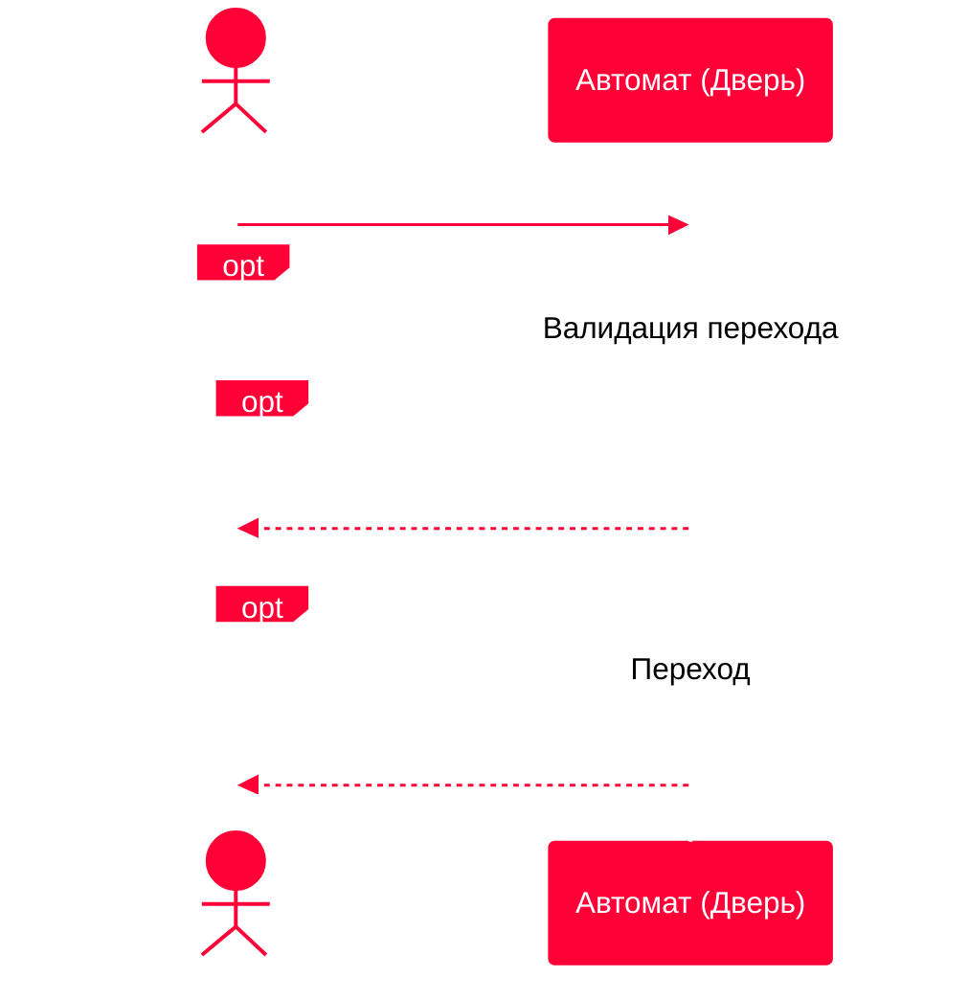
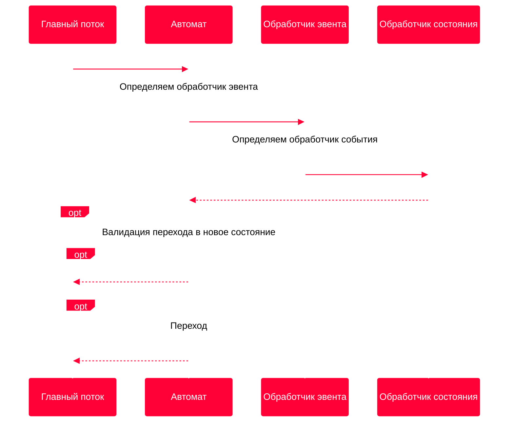
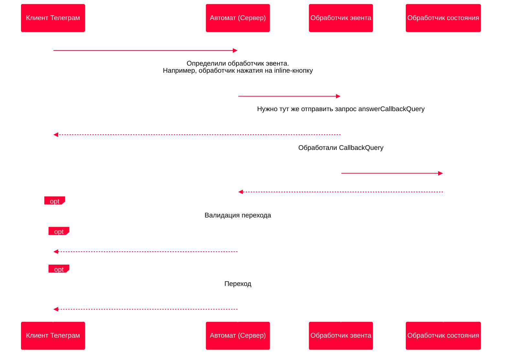
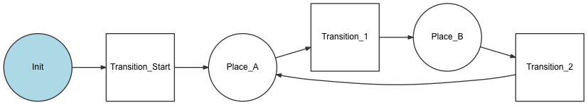

- [О чем будем говорить](#о-чем-будем-говорить)
- [Подумать подумать](#подумать-подумать)
- [Сначала интуитивные примеры](#сначала-интуитивные-примеры)
  - [Публикация документа](#публикация-документа)
  - [Транзакция в БД](#транзакция-в-бд)
- [Немножко матана](#немножко-матана)
  - [Откуда всё пошло](#откуда-всё-пошло)
  - ["Что мне дадут автоматы?"](#что-мне-дадут-автоматы)
- [Примеры посложнее](#примеры-посложнее)
  - [Дверь с замком](#дверь-с-замком)
  - [Переменная (даже работу с ней можно описать как state machine)](#переменная-даже-работу-с-ней-можно-описать-как-state-machine)
- [Итак](#итак)
  - [Обобщенная диаграмма последовательности обработки](#обобщенная-диаграмма-последовательности-обработки)
- [Подробный пример](#подробный-пример)
  - [Бот в Телеграм:](#бот-в-телеграм)
- [Имплементируем](#имплементируем)
  - [Как точно делать не надо](#как-точно-делать-не-надо)
  - [Имплементируем на функциях и почему](#имплементируем-на-функциях-и-почему)
  - [Имплементируем на классах и почему](#имплементируем-на-классах-и-почему)
    - [Как всегда паттерны](#как-всегда-паттерны)
  - ["Не понимаю, как лучше"](#не-понимаю-как-лучше)
- [Едем на готовом тандеме](#едем-на-готовом-тандеме)
  - [Для визуализации](#для-визуализации)
  - [Front-end](#front-end)
    - [Возможности XState](#возможности-xstate)
  - [Back-end (Symfony)](#back-end-symfony)
    - [Определения](#определения)
    - [Использование](#использование)
- [Источники](#источники)

# О чем будем говорить

- пофилософствуем
- поймем, что из себя в принципе представляют автоматы
- выделим понятия, полезные в практике
- подробно разберем несколько примеров автоматов
- разберемся, как реализовать свой автомат
- исследуем существующие решения для бэка и фронта  

# Подумать подумать

В рамках любой системы можно выделить две концепции: постоянство и изменение.

Со стороны постоянства системы основным определением выделяется **состояние** как "отпечаток" системы в конкретный момент времени. При этом у системы может быть очень различных параметров, но мы можем абстрагироваться от их конкретных значений и выделить "логические состояния" системы. 

Если взглянуть с математической точки зрения, то можно представить состояние системы как вектор в многомерном пространстве параметров, а  "логическое" состояние как некую область в этом пространстве. 

Со стороны изменения системы основным понятием будет **переход** из одного состояния в другое., то есть изменение ее параметров.

Согласитесь, будет удобно, если система будет иметь ограниченное количество "логических" состояний. Тогда и количество возможных переходов между ними будет конечным. В этом и есть смысл конечных автоматов. Они содержат описание всех таких логических состоний и переходов между ними.

Напрашивается вывод что это фундаментальное описание системы.

# Сначала интуитивные примеры

## Публикация документа


## Транзакция в БД


# Немножко матана


## Откуда всё пошло

**Абстрактный автомат** - математическая абстракция, модель дискретного устройства, имеющего один вход, один выход и в каждый момент времени находящегося в одном состоянии из множества возможных. На вход этому устройству поступают символы одного алфавита, на выходе оно выдаёт символы (в общем случае) другого алфавита.

Под символами можно воспринимать некоторые абстрактные обозначения наборов данных, а под алфавитом - все возможные такие наборы данных.


Абстрактный автомат можно описать по разному, но в общем функционирует так:
- Имеет начальное состояние (а1 на рисунке)
- Принимает входные сигналы z(t)
- Осуществляет переход в новое состояние a(t+1) на основе функции переходов (дельта)
- Выдает выходные сигналы w(t) на основе функции выходов (лямбда)
- Новое состояние a(t+1) может быть конечным (не имеет исходящих стрелочек). На рисунке нет конечных состояний

Автомат **конечный**, если у него конечное число состояний. Это может быть:

- **Автомат Мили** - выходные значения также зависят от входных (нужна дополнительная табличка для описания).


- **Автомат Мура** - частный случай автомата Мили, где выходные значения зависят только от внутреннего состояния.


Автомат **детерминированный**, если:
- мы точно знаем, какое будет следующее состояние в зависимости от текущего и входных данных 
- выход зависит только от текущего состояния и текущего входа

**Автоматное программирование** - парадигма программирования, при использовании которой программа или её фрагмент осмысливается как модель какого-либо формального автомата.

## "Что мне дадут автоматы?"

- **Интуитивность и наглядность**. Многие бизнес-процессы и пользовательские сценарии можно легко представить в виде состояний и переходов между ними. Это делает конечные автоматы интуитивно понятными для разработчиков, аналитиков и заказчиков
- **Простоту визуализации**. Конкретные конечные автоматы легко визуализируются и, соответственно, легко понимаются
- **Декларативное описание**. Есть возможность декларативно описать состояния и переходы между ними. Возможность обеспечить тесную связь документации и реализации
- **Четкое разделение логики**. Происходит четкое разделение логики между обработчиками состояний
- **Удобство тестирования и поддержки**. Легко тестировать и поддерживать: заранее известны все возможные состояния и переходы между ними
- **Моделирование параллельных процессов**. Хорошо подходят для моделирования параллельных процессов

# Примеры посложнее

## Дверь с замком




- тут можно обойтись без состояния "без замка" и раскрыть его, но так мы явно указываем, что закрытая и открытая дверь будет именно "без замка"
- детерминированный

## Переменная (даже работу с ней можно описать как state machine)

- Начальное состояние - определена
- Входные данные - новое значение переменной или ее удаление
- Выходные данные - значение переменной или какая-либо ошибка (нет значения или не определена)


| Состояние         | Эвент              | Вход     | Новое состояние   | Вывод |
| ----------------- | ------------------ | -------- | ----------------- | ----- |
| Определена        | Присвоить значение | newValue | Содержит значение | value |
| Определена        | Удалить            |          | Не определена     |
| Содержит значение | Присвоить значение | newValue | Содержит значение | value |
| Содержит значение | Получить значение  |          | Содержит значение | value |
| Содержит значение | Удалить            |          | Не определена     |

- конечный, т.к. кол-во состояний конечно, не смотря на то, что переменная может иметь очень много разных значений. В смысле данного автомата важно только, установлено значение или нет, а значение переменной хранится в контексте. Само значение имеет смысл уже при использовании переменной где-либо
- недетерминированный, т.к. при входе "Получить значение" в состоянии "Содержит значение" выход зависит не только от входа и текущего состояния, а также от значения value в контексте

# Итак

- **конечный автомат** (finite-state machine) - содержит **обработчики состояний**, которые производят **переходы** между конечным набором определенных состояний в ответ на **эвенты** (события) в зависимости от **контекста** автомата и **входа** (входных данных) и, возможно, изменяют контекст автомата и\или возвращают **вывод** (выходные данные).
- **контекст** - множество переменных, представляющих собой "память" автомата.
- **эвент** - сигнал к переходу в следующее состояние
- **обработчик эвента** - решает, какому обработчику состояния отдать входные данные
- **вход** - множество значений, поступающих в **обработчик состояния**
- **обработчик состояния** - логическая единица обработки конкретного состояния
- **переход** - изменение состояния (возможно, на то же самое).

## Обобщенная диаграмма последовательности обработки



# Подробный пример

## Бот в Телеграм:
- Начальное состояние - начало диалога, когда боту еще не отправлено ни одного сообщения
- Эвент - от Телеграм пришло обновление (создание, обновление или удаление сообщения, нажатие на inline-кнопку и т.д.)
- Входные данные - содержимое обновления
- Выходные данные - HTTP-запросы к Телеграм
- Состояния и тд. - зависят от логики бота

Примеры inline-клавиатур:




# Имплементируем

## Как точно делать не надо

Можно описать конкретные состояния логическими условиями на основе флагов (флаговое программирование), а их обработку внутри if блоков, но со временем таких флагов будет становиться все больше (**Boolean explosion**).

```javascript
if (isCreated && isEditable && isValid && !isDeleted {...}

// Или

if (isCreated) {
    ...
    if (isEditable) {
        ...
        if (isValid) {
            ...
        } else {
            ...
        }
    } else {
        ...
    }
} else {
    ...
}
```

Если у нас N флагов, то возможных обработчиков может быть 2^N.

К тому не возможные комбинации таких флагов будут соответствовать реальным состояниям.

## Имплементируем на функциях и почему

Можно использовать для реализации конкретных небольших задач (обработка строки и тд.).

| Понятие              | Реализация                                                                                       |
| -------------------- | ------------------------------------------------------------------------------------------------ |
| автомат              | функция                                                                                          |
| контекст             | переменные, объявленные в функции                                                                |
| обработчик состояния | блок кода внутри функции, в который перешел поток выполнения в зависимости от названия состояния |

Пример программы в автоматном стиле:

```c
int main() // <-- Автомат (без валидации переходов)
{
    enum states { 
        before, inside, after // <-- Описание состояний (без таблицы переходов)
    } state; // <-- Хранит идентификатор состояния
    state = before; // <-- Начальное состояние

    // Контекста нет :(

    int c; // <-- Используется для записи входа в обработчик состояния
    while ((c = getchar()) != EOF) { // <-- Формируем вход и бросаем эвент
        switch (state) { // <-- Обработчик эвента
        case before:
            if (c == '\n') { // <-- Обработчик состояния
                putchar('\n'); // <-- Вывод (тут в консоль)
            } else if (c != ' ') {
                putchar(c);
                state = inside; // <-- Переход
            }
            break;
        case inside: 
            switch (c) { // <-- Вложенное состояние
            case ' ':
                state = after;
                break;
            case '\n':
                putchar('\n');
                state = before;
                break;
            default:
                putchar(c);
            }
            break;
        case after:
            if (c == '\n') {
                putchar('\n');
                state = before;
            }
        }
    }
  
    return 0;
}
```

## Имплементируем на классах и почему

Этот вариант является уже архитектурным стилем и подойдет для больших и развивающихся проектов.

### Как всегда паттерны

Паттерн "Состояние"


Участники:

- State: определяет интерфейс состояния
- Классы State1 и State2 - конкретные реализации состояний
- Context: представляет объект, поведение которого должно динамически изменяться в соответствии с состоянием. Выполнение же конкретных действий делегируется объекту состояния

| Понятие              | Реализация                        |
| -------------------- | --------------------------------- |
| Автомат              | Класс контекста                   |
| Контекст             | Переменные в классе контекста     |
| Эвент                | Вызов метода в классе контекста   |
| Обработчик состояния | Класс состояния                   |
| Обработчик перехода  | Метод setState в классе контекста |

Абстрактный пример:
```php
<?php

// Описание состояний

abstract class State
{
    protected Context $context;

    public function setContext(Context $context)
    {
        $this->context = $context;
    }

    abstract public function handle1(): void;
    abstract public function handle2(): void;
}

class ConcreteStateA extends State // <-- Название класса состояния является идентификатором состояния
{ // <-- Весь класс является обработчиком состояния
    public function handle1(): void
    {
        echo "ConcreteStateA handles request1.\n"; // <-- Вывод (опять в консоль)
        echo "ConcreteStateA wants to change the state of the context.\n";
        $this->context->setState(new ConcreteStateB()); // <-- Переход
    }

    public function handle2(): void
    {
        // Тут можно выводить ошибку при невозможном переходе из этого состояния
        echo "ConcreteStateA handles request2.\n";
    }
}

class ConcreteStateB extends State
{
    public function handle1(): void
    {
        echo "ConcreteStateB handles request1.\n";
    }

    public function handle2(): void
    {
        echo "ConcreteStateB handles request2.\n";
        echo "ConcreteStateB wants to change the state of the context.\n";
        $this->context->setState(new ConcreteStateA());
    }
}

class Context // <-- Автомат
{
    // Сам по себе контекст мог бы быть тут :(

    public function __construct(private State $state)
    {
        $this->setState($state); // <-- Начальное состояние
    }

    /** Контекст позволяет изменять объект Состояния во время выполнения */
    public function setState(State $state): void // <-- Обработчик перехода
    {
        // Тут можно выводить ошибку при невозможном переходе в новое состояние
        echo "Context: Transition to " . get_class($state) . ".\n";
        $this->state = $state;
        $this->state->setContext($this);
    }

    /** Контекст делегирует часть своего поведения текущему объекту Состояния */
    public function request1(): void // <-- Обработчик эвента request1
    {
        $this->state->handle1();
    }

    public function request2(): void
    {
        $this->state->handle2();
    }
}

$context = new Context(new ConcreteStateA());
$context->request1(); // <-- Бросаем эвент
$context->request2();
```

Преимущества данного примера:
- При добавлении нового состояния нужно будет создать новый дочерний класс состояния, реализовать там новую логику и изменить обработчики эвентов в некоторых существующих классах событий, откуда может осуществиться переход в новое состояние  
- При добавлении нового возможного перехода в идеале нужно будет поменять только один обработчик эвента в состоянии, откуда осуществляется переход

Недостатки данного примера:
- Если эвентов очень много, а переходов между состояниями - мало, то большинство дочерних классов стейта будут иметь много boilerplate методов

## "Не понимаю, как лучше"

Чтобы гибко реализовать архитектуру вашего автомата, могу предложить ориентироваться на такую таблицу: 

| Понятие                 | Реализация                                                                                       |
| ----------------------- | ------------------------------------------------------------------------------------------------ |
| Автомат                 | Функция                                                                                          |
|                         | Класс                                                                                            |
| Контекст                | Переменные в функции или классе                                                                  |
|                         | Отдельный класс (DTO)                                                                            |
| Эвент                   | Условие в функции                                                                                |
|                         | Вызов метода автомата                                                                            |
|                         | Вызов метода отдельного класса, взаимодействующего с автоматом                                   |
| Обработчик эвента       | Блок кода                                                                                        |
|                         | Метод автомата                                                                                   |
|                         | Отдельный класс                                                                                  |
| Входные данные          | Переменные                                                                                       |
|                         | Параметры метода                                                                                 |
| Идентификатор состояния | Значение переменной                                                                              |
|                         | Название метода в автомате                                                                       |
|                         | Название класса состояния                                                                        |
| Обработчик состояния    | Блок кода в функции (внутри if\else или switch)                                                  |
|                         | Метод в автомате (обращение через variable functions в PHP)                                      |
|                         | Метод в отдельном классе-обработчике                                                             |
|                         | Класс состояния (обращение через полиморфизм)                                                    |
| Переход                 | Изменение переменной, содержащей идентификатор состояния                                         |
|                         | Вызов метода автомата (условный `setState`) с передачей названия или экземпляра класса состояния |
| Валидатор переходов     | Внутри `setState` в автомате                                                                     |
|                         | Внутри отдельного класса, вызываемого в `setState` в автомате                                    |

И, конечно же, на [диаграмму последовательности обработки](#обобщенная-диаграмма-последовательности-обработки)

# Едем на готовом тандеме

## Для визуализации

[](https://stately.ai)

Инструмент для моделирования и визуализации логики приложения в виде автоматов и диаграмм состояний.

Собственно, я его использовал для визуализации следующих автоматов в [Stately studio](https://stately.ai/docs/studio):
- [Дверь с замком](#дверь-с-замком)
- [Переменная](#переменная-даже-работу-с-ней-можно-описать-как-state-machine)

Возможности Stately studio:
- режим дизайна для создания автоматов:


- режим симуляциии для визуализации работы автомата

## Front-end

Stately тесно интегрирован с XState.

[](https://xstate.js.org/)

Решение для управления состоянием и оркестрации приложений JavaScript и TypeScript, использующее событийно-ориентированное программирование, конечные автоматы, диаграммы состояний и модель актеров для обработки сложной логики предсказуемыми, надежными и визуальными способами. Он не имеет никаких зависимостей с другими библиотеками.

Stately позволяет создать конфигурацию для XState и в других форматах из графического представления автомата:


### Возможности XState

Основные концепты:
- Автомат
- Актер - основан на [Actor model](https://en.wikipedia.org/wiki/Actor_model)

Простыми словами актеры - это "живые" объекты, которые могут взаимодействовать друг с другом посредством асинхронной передачи сообщений.

Некоторые возможности конфигурирования автомата:

```javascript
import { createMachine, assign, createActor } from 'xstate';

const textMachine = createMachine({
  context: { // <-- Контекст (в XState - всегда иммутабельный)
    committedValue: '',
    value: '',
  },
  initial: 'reading', // <-- Начальное состояние
  states: { // <-- Описание состояний
    reading: { // <-- Обработчик состояния reading
      on: {
        'text.edit': {  // <-- Обработчик эвента text.edit
            target: 'editing' // <-- Переход
        },
      },
    },
    editing: {
      on: {
        'text.change': {
          actions: // <-- Реакция на эвент
            assign({ // <-- Ф-ция assign нужна для изменения контекста
                value: ({ event }) => event.value,
            }),
        },
        'text.commit': {
          guard: 'isValid', // <-- Валидатор перехода
          actions: assign({
            committedValue: ({ context }) => context.value,
          }),
          target: 'reading', // <-- Защищенный переход (выполнится только, если isValid вернет true)
        },
        'text.cancel': {
          actions: assign({
            value: ({ context }) => context.committedValue,
          }),
          target: 'reading',
        },
      },
    },
  },
  {
    guards: { // <-- Логика валидаторов
      isValid: ({ context }) => {
        return context.committedValue.length > 0;
      },
    },
  },
});
```

Как автомат используется:

```javascript
const textActor = createActor(textMachine).start();

textActor.subscribe((state) => { // <-- Для логирования
  console.log(state.context.value);
});

textActor.send({ type: 'text.edit' }); // <-- Бросаем эвент
// logs ''
textActor.send({ type: 'text.change', value: 'Hello' }); // <-- Бросаем эвент с входными данными
// logs 'Hello'
textActor.send({ type: 'text.commit' });
// logs 'Hello'
textActor.send({ type: 'text.edit' });
// logs 'Hello'
textActor.send({ type: 'text.change', value: 'Hello world' });
// logs 'Hello world'
textActor.send({ type: 'text.cancel' });
// logs 'Hello'
```

В документации на каждый компонент конфигурации автомата в том числе есть шпаргалки (cheatsheets) с примерами кода.

## Back-end (Symfony)

В Symfony конечные автоматы используются в рамках workflows.

### Определения

**[Workflow (рабочий процесс)](https://symfony.com/doc/current/workflow.html)** - это жизненный цикл объекта, который состоит определяется множеством из мест (places) и переходов (transitions) между ними. Очень похожи на [сети Петри](https://ru.wikipedia.org/wiki/%D0%A1%D0%B5%D1%82%D1%8C_%D0%9F%D0%B5%D1%82%D1%80%D0%B8)



Более формально:
Place (место) - стадия рабочего процесса.
Transition (переход) - описание действия, необходимого, чтобы добраться от одного места до другого.
Definition (определение) состоит из множества мест и переходов.

Конечный автомат в Symfony - это частный случай рабочего процесса, и его цель — сохранять текущее состояние модели.
Отличия от рабочего процесса:
- Рабочие процессы могут находиться более чем в одном place одновременно
- При применении перехода рабочий процесс требует также, чтобы объект находился во всех определенных предыдущих местах перехода, а не только хотя бы в одном из них, как требует конечный автомат.

### Использование

Пример конфигурации:

```yaml
# config/packages/workflow.yaml
framework:
  workflows:
    blog_publishing:
      type: 'workflow' # или 'state_machine'
      audit_trail:
        enabled: true # <-- Включение детальных логов активности
      events_to_dispatch: ['workflow.leave', 'workflow.completed'] # <-- Опциональное указание бросаемых эвентов
      metadata: # <-- Опциональные метаданные
        title: 'Blog Publishing Workflow'
      marking_store: # <-- Настройки поля для хранения идентификатора состояния
        type: 'method'
        property: 'currentPlace'
      supports:
        - App\Entity\BlogPost # <-- Класс, участвующий в рабочем процессе
      initial_marking: draft # <-- Начальное состояние
      places:      # <-- Места
        - draft:
          metadata: # <-- Опциональные метаданные
            max_num_of_words: 500
        - reviewed
        - rejected
        - published
      transitions: # <-- Переходы
        to_review: # <-- Название перехода
          from: draft # <-- В from также можно указать массив
          to:   reviewed
        publish:
          guard: "is_authenticated" # <-- Пример валидации перехода
          from: reviewed
          to:   published
          metadata: # <-- Опциональные метаданные
            hour_limit: 20
            explanation: 'You cannot publish after 8 PM.'
        reject:
          guard: "is_granted('ROLE_ADMIN')"
          from: reviewed
          to:   rejected
```

Пример класса `App\Entity\BlogPost`:

```php
// src/Entity/BlogPost.php
namespace App\Entity;

class BlogPost
{
    // Тип string указывает Symfony на то, что модель может быть только в одном состоянии в одно время
    // Чтобы она могла быть сразу в нескольких состояниях, нужен тип array тут и в геттере и сеттере
    private string $currentPlace; // <-- Указано в конфиге
    private string $title;
    private string $content;
    
    // Геттер и сеттер обязательны, если $currentPlace не public
    public function getCurrentPlace(): string
    {
        return $this->currentPlace;
    }

    public function setCurrentPlace(string $currentPlace, array $context = []): void 
    {
        $this->currentPlace = $currentPlace;
    }
}
```

Работа с созданным workflow:

```php
use App\Entity\BlogPost;
use Symfony\Component\Workflow\WorkflowInterface;

class MyClass
{
    // Autowiring по имени
    public function __construct(
        private WorkflowInterface $blogPublishingWorkflow
    ) {
    }

    // или

    // Autowiring по атрибуту Target
    public function __construct(
        #[Target('blog_publishing')] private WorkflowInterface $workflow
    ) {
    }

    public function someMethod(BlogPost $post): void
    {
        // Проверки возможности осуществления перехода
        $this->workflow->can($post, 'publish'); // False
        $this->workflow->can($post, 'to_review'); // True

        try {
            $this->workflow->apply($post, 'to_review'); // <-- Переход
        } catch (LogicException $exception) {
            // ...
        }

        // Получить доступные переходы для текущего состояния
        $transitions = $this->workflow->getEnabledTransitions($post);
        // Получить переход 'publish' для текущего состояния
        $transition = $this->workflow->getEnabledTransition($post, 'publish');

        // Работа с метаданными
        $metadata = $this->workflow->getMetadataStore();

        $title = $metadata ->getWorkflowMetadata()['title'] ?? 'Default title';
        $maxNumOfWords = $metadata->getPlaceMetadata('draft')['max_num_of_words'] ?? 500;

        $aTransition = $this->workflow->getDefinition()->getTransitions()[1];
        $hourLimit = $metadata->getTransitionMetadata($aTransition)['hour_limit'] ?? 20;

        // Также можно через универсальный метод
        $title = $metadata->getMetadata('title');
        $maxNumOfWords = $metadata->getMetadata('max_num_of_words', 'draft');
        $hourLimit = $metadata->getMetadata('hour_limit', $aTransition);
    }
}
```

В Твиге есть соот-щие функции:

```twig

    <a href="...">Publish</a>


{# Цикл по возможным переходам #}

    <a href="...">{{ transition.name }}</a>

    No actions available.


{# Проверить, что объект в определенном месте #}

    <p>This post is ready for review.</p>


{# Проверить, что место отмечено в объекте #}

    <span class="label">Reviewed</span>


{# Цикл по блокировщикам перехода #}

    <span class="error">{{ blocker.message }}</span>


{# Получить метаданные #}
<p>
    <strong>Workflow</strong>:<br>
    <code>{{ workflow_metadata(blog_post, 'title') }}</code>
</p>

{# И т.д. #}
```

Можно использовать вместе с `EventDispatcher`. Symfony бросает эвенты при каких-либо действиях с workflow в порядке от общего к частному. Например при transition будут данные эвенты:

- workflow.transition
- workflow.[workflow name].transition
- workflow.[workflow name].transition.[transition name]

Аналогичные эвенты есть при прохождении валидации, входе в или выходе из place, успешном transition и т.д.

Пример листенера на все workflows, логирующего выходы из place:

```php
// src/App/EventSubscriber/WorkflowLoggerSubscriber.php
namespace App\EventSubscriber;

use Psr\Log\LoggerInterface;
use Symfony\Component\EventDispatcher\EventSubscriberInterface;
use Symfony\Component\Workflow\Event\Event;
use Symfony\Component\Workflow\Event\LeaveEvent;

class WorkflowLoggerSubscriber implements EventSubscriberInterface
{
    public function __construct(
        private LoggerInterface $logger,
    ) {
    }

    public function onLeave(Event $event): void
    {
        $this->logger->alert(sprintf(
            'Blog post (id: "%s") performed transition "%s" from "%s" to "%s"',
            $event->getSubject()->getId(),
            $event->getTransition()->getName(),
            implode(', ', array_keys($event->getMarking()->getPlaces())),
            implode(', ', $event->getTransition()->getTos())
        ));
    }

    public static function getSubscribedEvents(): array
    {
        return ['workflow.blog_publishing.leave' => 'onLeave'];
    }
}
```

Пример листенера на конкретный переход:

```php
class ArticleWorkflowEventListener
{
    #[AsTransitionListener(workflow: 'my-workflow', transition: 'published')]
    public function onPublishedTransition(TransitionEvent $event): void
    {
        // ...
    }
    // ...
}
```

# Источники
- Википедия
- https://www.youtube.com/watch?v=knoVv2ncwVI
- https://www.youtube.com/watch?v=vlqtNtTMdpk
- https://refactoring.guru/ru/design-patterns/state/php/example
- [Stately](https://stately.ai/docs)
- [Symfony workflows](https://symfony.com/doc/current/workflow.html)
